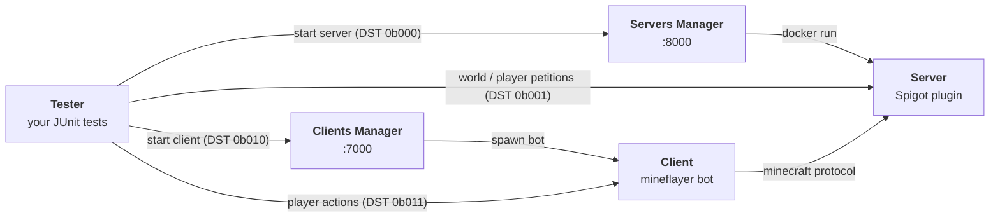

# WatchWolf

[](https://watchwolf.dev/)
[](LICENSE)

**WatchWolf is an integration-testing environment for Minecraft plugins.** You describe the
servers you want (type, version, plugins, world, config files) and the players that should join
them; WatchWolf starts *real* Minecraft servers and *real* clients, drives them from your JUnit
tests, and tears everything down afterwards.

```java
@ParameterizedTest
@ArgumentsSource(WorldInteractionPetitionsShould.class)
public void breakBlock(TesterConnector connector) throws Exception {
    String username = connector.getClients()[0];
    ExtendedClientPetition client = connector.getClientPetition(username);

    Position target = client.getPosition().add(0, -1, 0);
    client.breakBlock(target);

    assertEquals(Blocks.AIR, connector.server.getBlock(target));
}
```

This repository holds the **standard**: the wire protocol every WatchWolf module speaks, the
machine-readable API definitions, and the setup script that installs a working environment.
The modules themselves live in their own repositories (see [Implementations](#implementations)).

---

## Table of contents

- [Architecture](#architecture)
- [Quick start](#quick-start)
- [The API](#the-api)
- [Working on the standard](#working-on-the-standard)
- [Implementations](#implementations)
- [Repository layout](#repository-layout)
- [Contributing](#contributing)

---

## Architecture

WatchWolf splits into five programs, each with a single responsibility. Every arrow below is a
TCP socket speaking the [WatchWolf API](#the-api).



| Module | Responsibility | Language | Repository |
| --- | --- | --- | --- |
| **Tester** | Entry point. Orchestrates setup/teardown and runs your tests. | Java 8 | [WatchWolf-Tester](https://github.com/miranda1000/WatchWolf-Tester) |
| **Servers Manager** | Provides Minecraft servers on demand (one Docker container each) and frees them afterwards. | Java 17 | [WatchWolf-ServersManager](https://github.com/miranda1000/WatchWolf-ServersManager) |
| **Server** | The Minecraft server itself. A Spigot plugin that executes the Tester's commands in-game. | Java 8 | [WatchWolf-Server](https://github.com/miranda1000/WatchWolf-Server) |
| **Clients Manager** | Same as the Servers Manager, but for players. Starts bots and connects them to a server. | Python 3 | [WatchWolf-Client](https://github.com/miranda1000/WatchWolf-Client) |
| **Client** | A headless Minecraft client that can move, mine, chat and record video. | Python 3 + Node | [WatchWolf-Client](https://github.com/miranda1000/WatchWolf-Client) |

Two supporting repositories complete the picture:

| Module | Responsibility | Repository |
| --- | --- | --- |
| **Core** | Shared entities (blocks, items, entities, plugins) and the RPC runtime + code generator. | [WatchWolf-Core](https://github.com/watch-wolf/WatchWolf-Core) |
| **Material Getter** | Spigot plugin that extracts every block/item of a Minecraft version and generates the `blocks.special` classes consumed by Core and Tester. | [WatchWolf-MaterialGetter](https://github.com/miranda1000/WatchWolf-MaterialGetter) |

### Ports

| Port | Used by |
| --- | --- |
| `8000` | Servers Manager (accepts Tester connections) |
| `8001+` | One Minecraft server per **pair** of ports: `N` is the Minecraft port, `N+1` is the WatchWolf Server socket |
| `7000` | Clients Manager (accepts Tester connections) |
| `7001+` | One client per **pair** of ports: `N` is the client socket, `N+1` streams the recorded images |

---

## Quick start

The [`cli/`](cli/) module installs and runs everything the Tester needs (the Servers Manager and
the Clients Manager) from one Docker image — the host needs **`git`** and **Docker** and nothing
else, on Linux, macOS, Windows or WSL. There is no published `watchwolf` image to fetch (defaulting
to a guessable registry name would be a supply-chain risk — see `cli/watchwolf`'s own header); the
launcher always builds the image itself from the checkout, so it needs to run from one.

1. **Clone the repository**

   ```bash
   git clone https://github.com/watch-wolf/WatchWolf
   cd WatchWolf
   ```

2. **Build**

   ```bash
   ./cli/watchwolf build
   ```

   The first run builds the CLI's own image (a few minutes, cached after); on a terminal, it then
   opens a menuconfig-style checkbox screen (space to toggle, Enter to open a submenu) for choosing
   the branch, the Spigot/Paper versions, the usual plugins and whether to register a startup
   service — pass flags instead for a non-interactive run. It clones the Servers Manager and
   Clients Manager, pulls the JDK images, downloads the "usual plugins" and builds the Spigot/Paper
   jars, verifying every step as it goes. Have at least **1.5 GB** free; building the Spigot
   servers can take up to an hour.

3. **Install** *(optional — makes `watchwolf` available everywhere, starts it at boot, and runs a
   self-diagnosis against a real server)*

   ```bash
   ./cli/watchwolf install
   ```

4. **Run**

   ```bash
   ./cli/watchwolf run
   ```

Once it is up, point your tests at the machine running it (see the Tester's
[configuration file](https://github.com/miranda1000/WatchWolf-Tester)) and you are ready to go. See
[`cli/README.md`](cli/README.md) for the full command reference — including `watchwolf monitor`, a
live dashboard of the managers, their servers and their bots, and `watchwolf doctor`/`watchwolf
logs` for diagnosing a broken environment.

`WatchWolfSetup.sh` — the Bash script this replaces — is kept for one release as a
[deprecated shim](WatchWolfSetup.sh) that forwards to the CLI, so `bash WatchWolfSetup.sh --build`
and its flags keep working **from a checkout**. The previously documented single-file
`wget .../WatchWolfSetup.sh` download no longer works on its own: the CLI has no published image to
fall back to and always builds itself from this repository's `Dockerfile`, so a lone downloaded
script has nothing to build from and fails with a message pointing at `git clone` instead.

---

## The API

Every WatchWolf module talks over TCP using the same framing. A packet starts with a 16-bit
header (sent LSB first) followed by the operation's arguments:

```
 15                                4   3   2       0
+------------------------------------+---+---------+
|             operation              | r |   DST   |
+------------------------------------+---+---------+
|                  arguments ...                   |
+--------------------------------------------------+
```

- **DST** — which module the packet is for. When **r** is set, DST means *origin* instead.

  | DST | Destination |
  | --- | --- |
  | `0b000` | Servers Manager petition |
  | `0b001` | Server petition |
  | `0b010` | Clients Manager petition |
  | `0b011` | Client petition |
  | `0b1XX` | *Reserved* |

- **r** (response) — `0` for a request, `1` for a reply or an asynchronous notification.
- **operation** — the request itself; the set of operations depends on the DST. Operation
  `0b000000000000` is always a NOP (a keep-alive, so a long test is not dropped for inactivity).

Arguments use language-independent encodings (characters, booleans, doubles, strings, arrays,
files, positions, blocks, items, entities, containers…). **The full specification lives in
[`API/API.pdf`](API/API.pdf)** — that document is the source of truth for the protocol.

### Machine-readable definitions

[`API/definitions/`](API/definitions) mirrors part of that specification as JSON, one file per
module. These are consumed by tooling rather than read by hand:

- `api-docs.py` renders them into byte-field SVGs and a Markdown page for the website.
- WatchWolf-Core's `ci/rpc-gen.sh` generates the Java RPC stubs from them.

Today only [`servers_manager.json`](API/definitions/servers_manager.json) exists; the other
modules are still described only in the PDF.

---

## Working on the standard

### Rendering the definitions to docs

```bash
sudo docker build -f api-docs.Dockerfile --tag api-docs-builder .
sudo docker run -i --rm --name API-docs-builder \
    -v ./API/definitions:/app/API/definitions api-docs-builder:latest
```

This regenerates the `.md` and `.svg` files next to each definition. **Do not edit those by
hand** — edit the `.json` and re-run the container.

### Building the PDF

`API/API.tex` uses `glossaries` and `apacite`, so it needs the full four-pass build:

```bash
cd API
pdflatex -synctex=1 -interaction=nonstopmode API.tex
bibtex API
makeglossaries API
pdflatex -synctex=1 -interaction=nonstopmode API.tex
pdflatex -synctex=1 -interaction=nonstopmode API.tex
```

`API/A-Blocks.tex` (the block-type appendix) and `API/diagram.tex` are included from `API.tex`.

### The UML model

`Diagram.mdj` is a [StarUML](https://staruml.io/) model of the framework.

---

## Implementations

A full reference implementation of every module is available:

- [WatchWolf-Tester](https://github.com/miranda1000/WatchWolf-Tester) — JUnit 5 test harness
- [WatchWolf-ServersManager](https://github.com/miranda1000/WatchWolf-ServersManager) — Docker-backed server provider
- [WatchWolf-Server](https://github.com/miranda1000/WatchWolf-Server) — Spigot plugin ([pre-compiled builds](https://watchwolf.dev/versions/))
- [WatchWolf-Client](https://github.com/miranda1000/WatchWolf-Client) — Clients Manager & mineflayer client
- [WatchWolf-Core](https://github.com/watch-wolf/WatchWolf-Core) — shared entities and RPC runtime
- [WatchWolf-MaterialGetter](https://github.com/miranda1000/WatchWolf-MaterialGetter) — block/item class generator

---

## Repository layout

```
.
├── API/
│   ├── API.tex             # the specification (source of truth)
│   ├── API.pdf             # rendered specification
│   ├── A-Blocks.tex        # appendix: every block type and its properties
│   ├── diagram.tex         # the architecture figure included by API.tex
│   ├── glossaries.tex      # acronyms and glossary entries
│   ├── sample.bib          # bibliography
│   └── definitions/        # machine-readable API (JSON) + generated .md/.svg
├── api-docs.py             # definitions -> SVG/Markdown renderer
├── api-docs.Dockerfile     # container that runs api-docs.py
├── cli/                    # the `watchwolf` CLI: build / install / run / monitor / diagnose
│   ├── watchwolf           #   the launcher (the only file needed on the host)
│   └── src/                #   Java 17, picocli + Lanterna, see cli/AGENTS.md
├── WatchWolfSetup.sh       # deprecated shim -> forwards to cli/watchwolf
└── Diagram.mdj             # StarUML model
```

Generated artefacts (`API/API-*.aux`, `API/definitions/*/`, …) are covered by `.gitignore`;
only the `.tex`, `.json`, the rendered `API.pdf` and the checked-in SVG/Markdown are tracked.

---

## Contributing

Found a problem or want a new operation in the protocol? Open an issue at
[watch-wolf/WatchWolf](https://github.com/watch-wolf/WatchWolf/issues). Changes to the protocol
should land in `API/API.tex` first, then in the JSON definitions, then in the implementations.

WatchWolf is MIT licensed (see [LICENSE](LICENSE)) and accepts sponsorship through
[GitHub Sponsors](https://github.com/sponsors/miranda1000).
